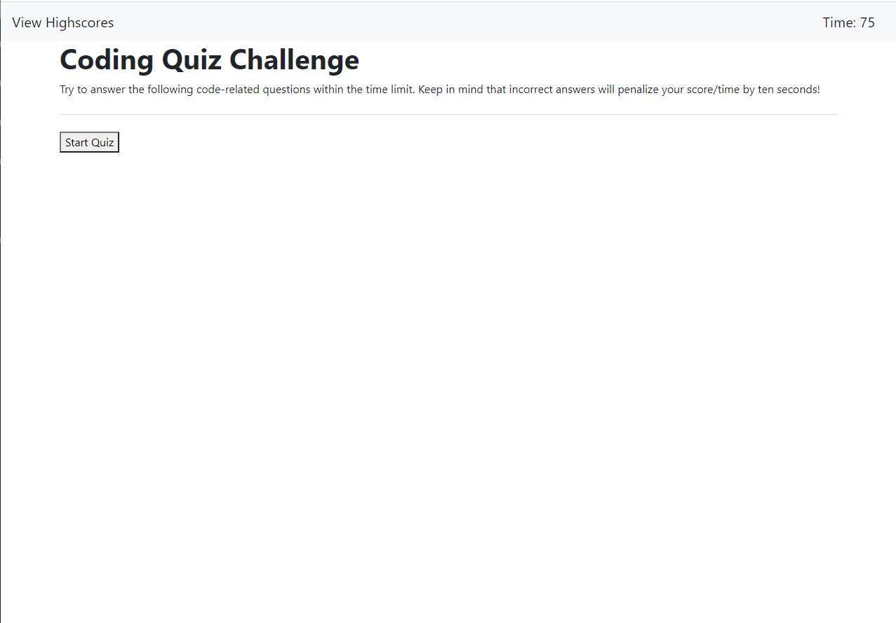

# code-quiz

This assignment is a timed coding quiz with multiple choice questions, that runs in the browser, and features dynamically updated HTML and CSS powered by JavaScript code that you write. When the start quiz button is clicked, a timer starts and the user is presented with questions. When a question is answered incorrectly, time is subtracted from the clock and when all questions are answered or the timer reaches 0, the game is over and the initials and score of the user is saved.

## Screenshot

## Link to Website

https://itsjustikenna.github.io/code-quiz/